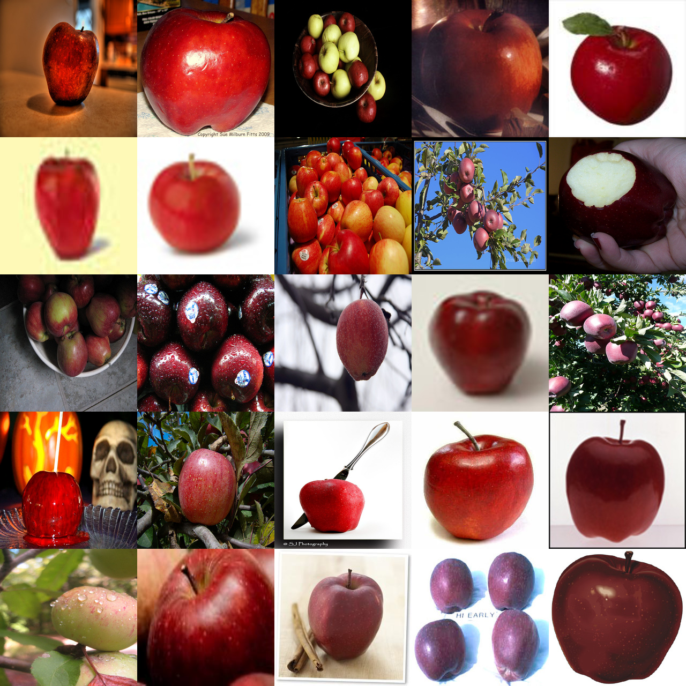
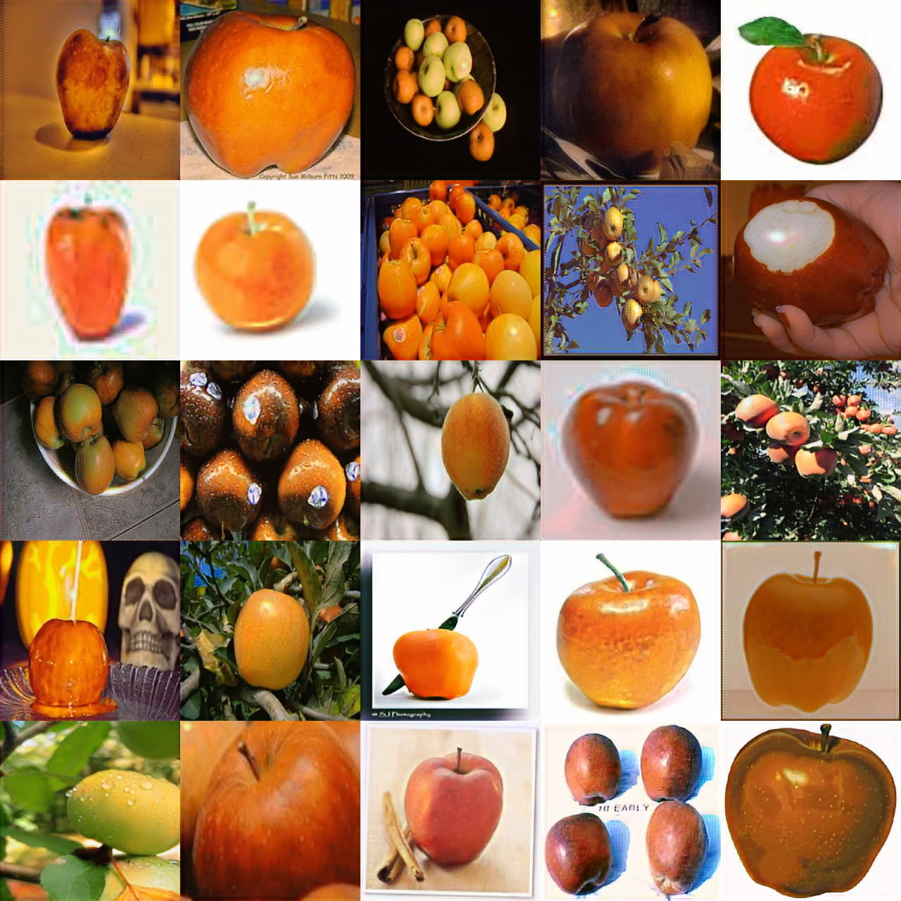

# The Simplest CycleGAN Full Implementation

Unpaired Image-to-Image Translation using Cycle-Consistent Adversarial Networks

## Requirement

Check the `requirements.txt`

## TODO
- replay buffer

## Run

It will automatically download the data in `data.py`.

```python
python3 train.py
```

## Distributed Training

GAN-like networks are particularly challenging given that they often use multiple optimizers.
In addition, GANs also consume a large amont of GPU memory and are usually batch-size sensitive.

To speed up training, we thus use a novel [KungFu](https://github.com/lsds/KungFu) distributed training library.
KungFu is easy to install and run (compared to today's Horovod library
which depends on OpenMPI). You can install it using a few lines by following
the [instruction](https://github.com/lsds/KungFu#install). KungFu is also very fast and scalable, compared
to Horovod and parameter servers, making it an attractive option for GAN networks.

In the following, we assume that you have added `kungfu-run` into the `$PATH`.

(i) To run on a machine with 4 GPUs:

```bash
kungfu-run -np 4 python3 train.py --parallel --kf-optimizer=sma
```

The default KungFu optimizer is `sma` which implements synchronous model averaging.
The `sma` decouple batch size and the number of GPUs, making it hyper-parameter-robust during scaling.
You can also use other KungFu optimizers: `sync-sgd` (which is the same as the DistributedOptimizer in Horovod)
and `async-sgd` if you train your model in a cluster that has limited bandwidth and straggelers.

(ii) To run on 2 machines (which have the nic `eth0` with IPs as `192.168.0.1` and `192.168.0.2`):

```bash
kungfu-run -np 8 -H 192.168.0.1:4,192.168.0.1:4 -nic eth0 python3 train.py --parallel --kf-optimizer=sma
```

## Results

<a href="https://join.slack.com/t/tensorlayer/shared_invite/enQtMjUyMjczMzU2Njg4LWI0MWU0MDFkOWY2YjQ4YjVhMzI5M2VlZmE4YTNhNGY1NjZhMzUwMmQ2MTc0YWRjMjQzMjdjMTg2MWQ2ZWJhYzc">
<div align="center">
	
</div>
</a>

<a href="https://join.slack.com/t/tensorlayer/shared_invite/enQtMjUyMjczMzU2Njg4LWI0MWU0MDFkOWY2YjQ4YjVhMzI5M2VlZmE4YTNhNGY1NjZhMzUwMmQ2MTc0YWRjMjQzMjdjMTg2MWQ2ZWJhYzc">
<div align="center">
        
</div>
</a>


## Author
- @zsdonghao
- @luomai

### Discussion

- [TensorLayer Slack](https://join.slack.com/t/tensorlayer/shared_invite/enQtMjUyMjczMzU2Njg4LWI0MWU0MDFkOWY2YjQ4YjVhMzI5M2VlZmE4YTNhNGY1NjZhMzUwMmQ2MTc0YWRjMjQzMjdjMTg2MWQ2ZWJhYzc)
- [TensorLayer WeChat](https://github.com/tensorlayer/tensorlayer-chinese/blob/master/docs/wechat_group.md)

### License

- For academic and non-commercial use only.
- For commercial use, please contact tensorlayer@gmail.com.
